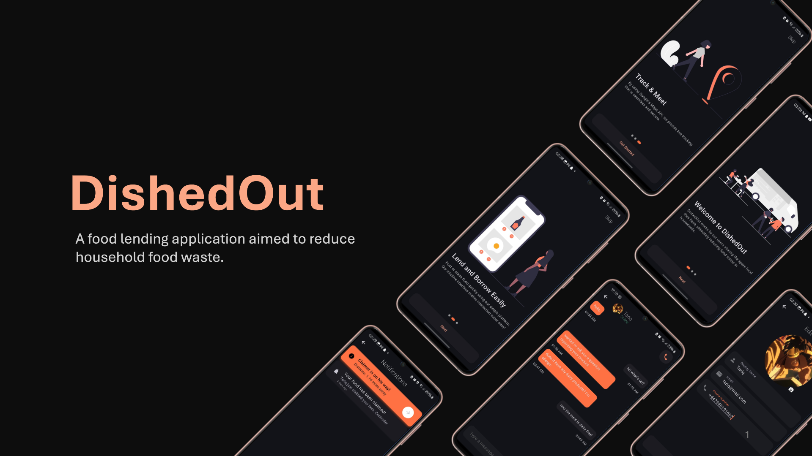

# DishedOut 🍽️


A food lending application built with Flutter that connects the local community with the goal of reducing food waste. Designed with accessibility and community support in mind, it enables users to post, claim and manage food items with ease.

## 📱 Features

- 🔐 **Firebase Authentication** - Secure sign up and login
- 🗺️ **Google Places Autocomplete** - Address selection with coordinates, making selecting a pick-up location an easy experience.
- 📷 **Image Uploading** - Attach photos to your food items
- 📝 **Post Creating** Add anme, description, image, and location
- ✅ **Claim items** - Reserve meals before they're gone
- 🔔 **Push Notifications** - Real-time updates using Firebase Cloud Messaging
- 👤 **User Profiles** - Update info and manage listed/claimed items
- 💬 **Direct Messaging** - Build local relationships through real-time messaging

---

## Tech Stack

- **Flutter** (Dart)
- **Firebase**
  - Authentication
  - Firestore
  - Cloud Stoage
  - Cloud Messaging
  - Cloud Functions
- **Riverpod** for state management
- **Geolocator** + **Google Places APi** for location services

---

## ⚙️ Installation

1. Clone the repo

```bash
git clone https://github.com/txriq03/dishedout
cd dishedout
```

2. Install dependencies

```bash
flutter pub get
```

3. Configure Firebase:

   - Add your `google-services.json` and `GoogleService-Info.plist` to the appropriate directories.
   - Set up Firestore rules and storage permissions.

4. Run the app

```bash
flutter run
```

## 👨‍💻 Author

Tariq Brown

[Portfolio Website](https://tariqbrown.dev) • [Github](https://github.com/txriq03)
